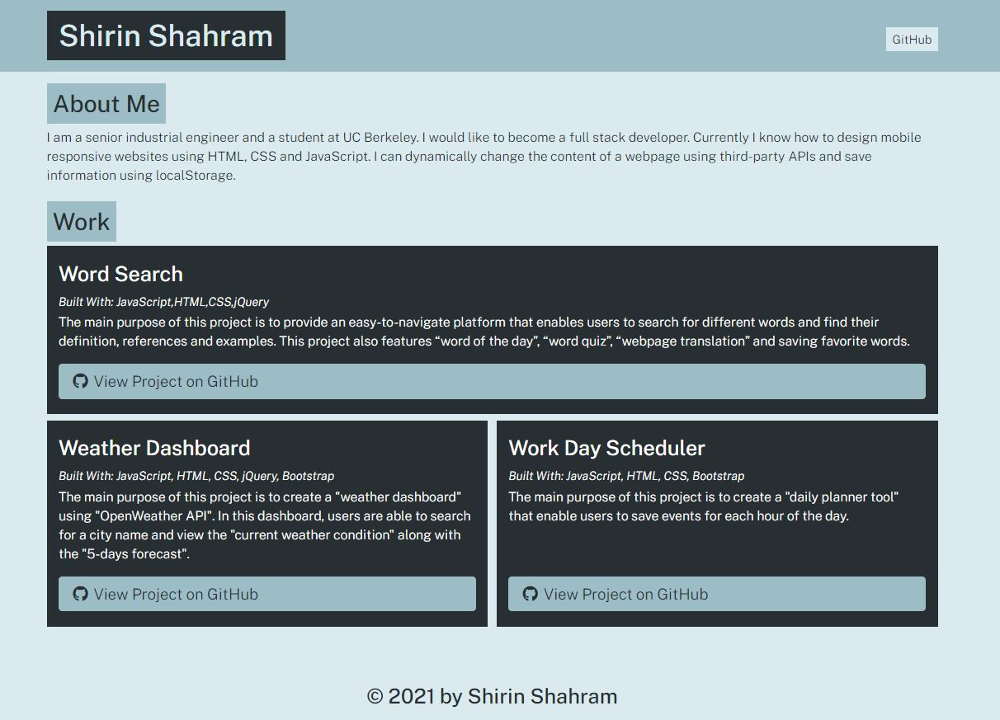

# portfolio-generator

## Description

The main purpose of this project is to create a "portfolio generator" tool using Node.js. Here, a series of questions will be asked from users and their response will be collected and shown in the browser.

---
## Requirements

For development, you will only need Node.js and a node package (inquirer), installed in your environement.

### Node
- #### Node installation on Windows

  Just go on [official Node.js website](https://nodejs.org/) and download the installer.
Also, be sure to have `git` available in your PATH, `npm` might need it (You can find git [here](https://git-scm.com/)).

- #### Node installation on Ubuntu

  You can install nodejs and npm easily with apt install, just run the following commands.

      $ sudo apt install nodejs
      $ sudo apt install npm

- #### Other Operating Systems
  You can find more information about the installation on the [official Node.js website](https://nodejs.org/) and the [official NPM website](https://npmjs.org/).

If the installation was successful, you should be able to run the following command.

    $ node --version
   

    $ npm --version
    

If you need to update `npm`, you can make it using `npm`! After running the following command, just open again the command line:

    $ npm install npm -g

## Run the project

    $ git clone https://github.com/YOUR_USERNAME/PROJECT_TITLE
    $ cd PROJECT_TITLE
    $ install npm packages
    $ run node app
    $ Answer questions

## Screenshots

After answering the questions related to your portfolio, the finished web page should look like the following image:

